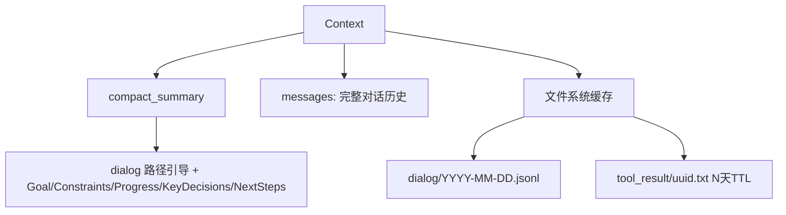
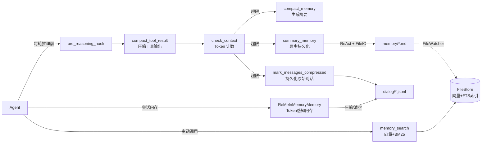
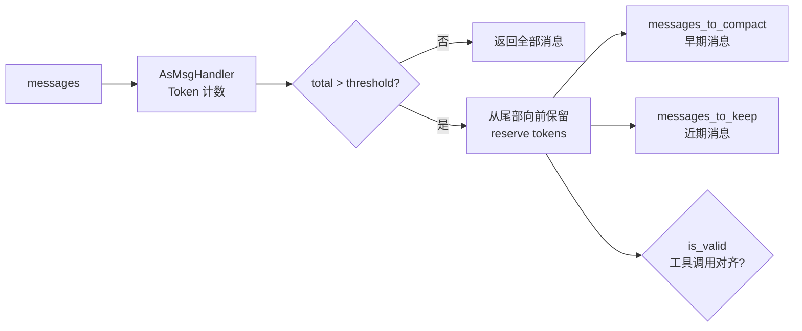
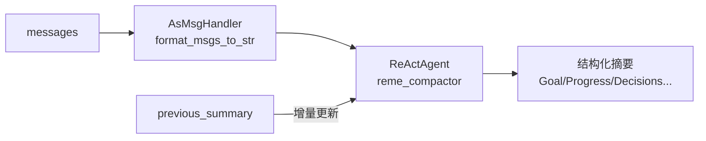
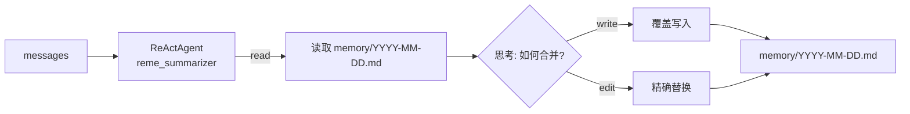
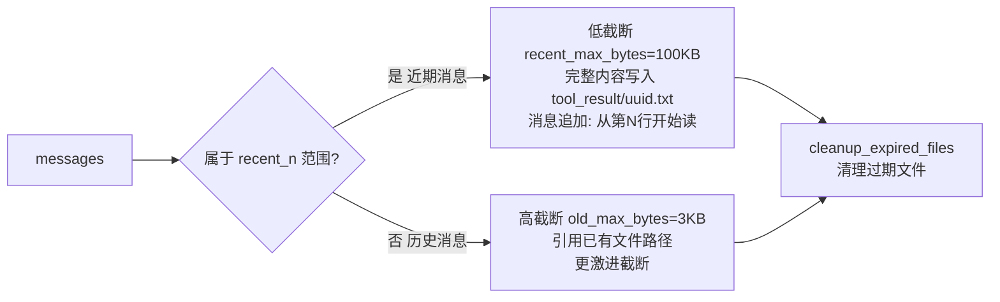
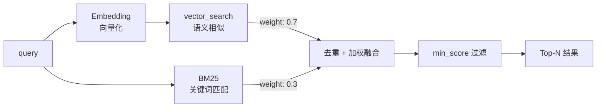
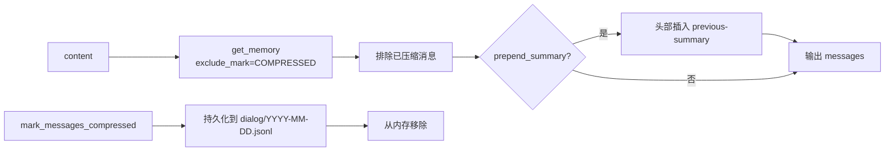
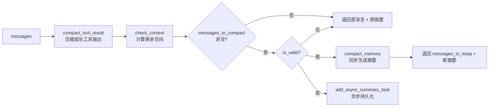
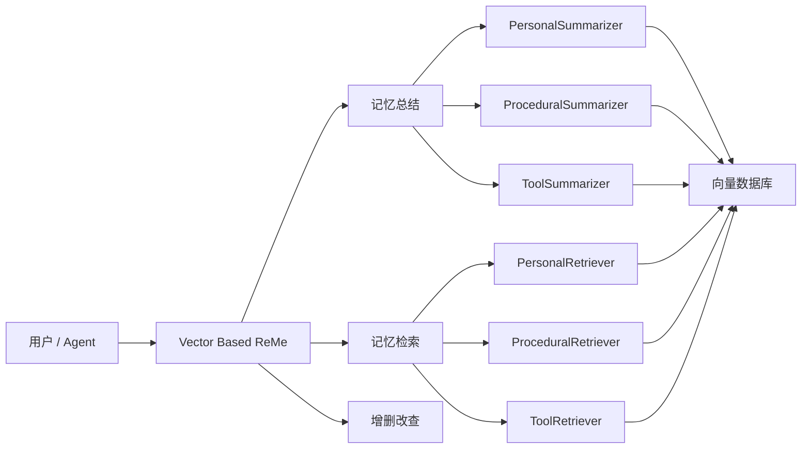

<p align="center">
 
</p>

<p align="center">
  <a href="https://pypi.org/project/reme-ai/"></a>
  <a href="https://pypi.org/project/reme-ai/"></a>
  <a href="https://pepy.tech/project/reme-ai/"></a>
  <a href="https://github.com/agentscope-ai/ReMe"></a>
</p>

<p align="center">
  <a href="./LICENSE"></a>
  <a href="./README.md"></a>
  <a href="./README_ZH.md"></a>
  <a href="https://github.com/agentscope-ai/ReMe"></a>
  <a href="https://deepwiki.com/agentscope-ai/ReMe"></a>
</p>

<p align="center">
<a href="https://trendshift.io/repositories/20528" target="_blank"></a>
</p>

<p align="center">
  <strong>面向智能体的记忆管理工具包，Remember Me, Refine Me.</strong><br>
</p>

> 老版本请参阅 [0.2.x 版本文档](docs/README_0_2_x_ZH.md)

---

## 📰 最新文章

| 日期         | 标题                                                 |
|------------|----------------------------------------------------|
| 2026-03-30 | [CoPaw 上下文管理设计解析](docs/copaw_context_design_zh.md) |

---

🧠 ReMe 是一个专为 **AI 智能体** 打造的记忆管理框架，同时提供基于[文件系统](#-基于文件的记忆系统-remelight)
和基于[向量库](#-基于向量库的记忆系统)的记忆系统。

它解决智能体记忆的两类核心问题：**上下文窗口有限**（长对话时早期信息被截断或丢失）、**会话无状态**（新对话无法继承历史，每次从零开始）。

ReMe 让智能体拥有**真正的记忆力**——旧对话自动浓缩，重要信息持久保存，下次对话自动想起来。

在 LoCoMo 与 HaluMem 基准测试中，ReMe 取得了领先结果，详见[实验效果](#实验效果)。

<details>
<summary><b>你可以用 ReMe 做什么</b></summary>

<br>

- **个人助理**：为 [CoPaw](https://github.com/agentscope-ai/CoPaw) 等智能体提供长期记忆，记住用户偏好和历史对话。
- **编程助手**：记录代码风格偏好、项目上下文，跨会话保持一致的开发体验。
- **客服机器人**：记录用户问题历史、偏好设置，提供个性化服务。
- **任务自动化**：从历史任务中学习成功/失败模式，持续优化执行策略。
- **知识问答**：构建可检索的知识库，支持语义搜索和精确匹配。
- **多轮对话**：自动压缩长对话，在有限上下文窗口内保留关键信息。

</details>

---

## 📁 基于文件的记忆系统 (ReMeLight)

> 记忆即文件，文件即记忆

将**记忆视为文件**——可读、可编辑、可复制。
[CoPaw](https://github.com/agentscope-ai/CoPaw) 通过继承 `ReMeLight` 实现了长期记忆和上下文的管理。

| 传统记忆系统    | File Based ReMe |
|-----------|-----------------|
| 🗄️ 数据库存储 | 📝 Markdown 文件  |
| 🔒 不可见    | 👀 随时可读         |
| ❌ 难修改     | ✏️ 直接编辑         |
| 🚫 难迁移    | 📦 复制即迁移        |

```
working_dir/
├── MEMORY.md              # 长期记忆：用户偏好等持久信息
├── memory/
│   └── YYYY-MM-DD.md      # 每日日记：对话结束后自动写入
├── dialog/                # 原始对话记录：压缩前的完整对话
│   └── YYYY-MM-DD.jsonl   # 按日期存储的对话消息（JSONL 格式）
└── tool_result/           # 超长工具输出缓存（自动管理，超期自动清理）
    └── <uuid>.txt
```

### 核心能力

[ReMeLight](reme/reme_light.py) 是该记忆系统的核心类，为 AI Agent 提供完整的记忆管理能力：

<table>
<tr><th>类别</th><th>方法</th><th>功能</th><th>关键组件</th></tr>
<tr><td rowspan="4">上下文管理</td><td><code>check_context</code></td><td>📊 检查上下文大小</td><td><a href="reme/memory/file_based/components/context_checker.py">ContextChecker</a> — 检查上下文是否超出阈值并拆分 Message</td></tr>
<tr><td><code>compact_memory</code></td><td>📦 压缩历史对话为摘要</td><td><a href="reme/memory/file_based/components/compactor.py">Compactor</a> — ReActAgent 生成结构化上下文摘要</td></tr>
<tr><td><code>compact_tool_result</code></td><td>✂️ 压缩超长工具输出</td><td><a href="reme/memory/file_based/components/tool_result_compactor.py">ToolResultCompactor</a> — 截断超长的工具调用结果并转存到 <code>tool_result/</code>，消息中保留文件引用</td></tr>
<tr><td><code>pre_reasoning_hook</code></td><td>🔄 推理前预处理钩子</td><td>compact_tool_result + check_context + compact_memory + summary_memory(async)</td></tr>
<tr><td rowspan="2">长期记忆</td><td><code>summary_memory</code></td><td>📝 将重要记忆写入文件</td><td><a href="reme/memory/file_based/components/summarizer.py">Summarizer</a> — ReActAgent + 文件工具（read / write / edit）</td></tr>
<tr><td><code>memory_search</code></td><td>🔍 语义搜索记忆</td><td><a href="reme/memory/file_based/tools/memory_search.py">MemorySearch</a> — 向量 + BM25 混合检索</td></tr>
<tr><td rowspan="2">会话内存</td><td><code>get_in_memory_memory</code></td><td>💾 创建会话内存实例</td><td>返回 ReMeInMemoryMemory，自动配置 dialog_path 实现对话持久化</td></tr>
<tr><td><code>await_summary_tasks</code></td><td>⏳ 等待异步摘要任务</td><td>阻塞等待所有后台摘要任务完成</td></tr>
<tr><td>-</td><td><code>start</code></td><td>🚀 启动记忆系统</td><td>初始化文件存储、文件监控、Embedding 缓存；清理过期工具结果文件</td></tr>
<tr><td>-</td><td><code>close</code></td><td>📕 关闭并清理</td><td>清理工具结果文件、停止文件监控、保存 Embedding 缓存</td></tr>
</table>

---

### 🚀 快速开始

#### 安装

**从源码安装：**

```bash
git clone https://github.com/agentscope-ai/ReMe.git
cd ReMe
pip install -e ".[light]"
```

**更新到最新版本：**

```bash
git pull
pip install -e ".[light]"
```

#### 环境变量

`ReMeLight` 环境变量配置 Embedding 和存储后端

| Variable             | Description             | Example                                             |
|----------------------|-------------------------|-----------------------------------------------------|
| `LLM_API_KEY`        | LLM API key             | `sk-xxx`                                            |
| `LLM_BASE_URL`       | LLM base URL            | `https://dashscope.aliyuncs.com/compatible-mode/v1` |
| `EMBEDDING_API_KEY`  | Embedding API key (可选)  | `sk-xxx`                                            |
| `EMBEDDING_BASE_URL` | Embedding base URL (可选) | `https://dashscope.aliyuncs.com/compatible-mode/v1` |

#### Python 使用

```python
import asyncio

from reme.reme_light import ReMeLight


async def main():
    # 初始化 ReMeLight
    reme = ReMeLight(
        default_as_llm_config={"model_name": "qwen3.5-35b-a3b"},
        # default_embedding_model_config={"model_name": "text-embedding-v4"},
        default_file_store_config={"fts_enabled": True, "vector_enabled": False},
        enable_load_env=True,
    )
    await reme.start()

    messages = [...]  # 对话消息列表

    # 1. 检查上下文大小（Token 计数，判断是否需要压缩）
    messages_to_compact, messages_to_keep, is_valid = await reme.check_context(
        messages=messages,
        memory_compact_threshold=90000,  # 触发压缩的阈值（tokens）
        memory_compact_reserve=10000,  # 保留的近期消息 token 数
    )

    # 2. 将历史对话压缩为结构化摘要（可传入上轮摘要，实现增量更新）
    summary = await reme.compact_memory(
        messages=messages,
        previous_summary="",
        max_input_length=128000,  # 模型上下文窗口（tokens）
        compact_ratio=0.7,  # 达到 max_input_length * 0.7 时触发压缩
        language="zh",  # 摘要语言（zh / ""）
    )

    # 3. 压缩超长工具输出（防止工具结果撑爆上下文）
    messages = await reme.compact_tool_result(messages)

    # 4. 推理前预处理钩子（自动压缩工具结果 + 检查上下文 + 生成摘要）
    processed_messages, compressed_summary = await reme.pre_reasoning_hook(
        messages=messages,
        system_prompt="你是一个有帮助的 AI 助手。",
        compressed_summary="",
        max_input_length=128000,
        compact_ratio=0.7,
        memory_compact_reserve=10000,
        enable_tool_result_compact=True,
        tool_result_compact_keep_n=3,
    )

    # 5. 将重要记忆写入文件（摘要写入 memory/YYYY-MM-DD.md）
    summary_result = await reme.summary_memory(
        messages=messages,
        language="zh",
    )

    # 6. 语义搜索记忆（向量 + BM25 混合检索）
    result = await reme.memory_search(query="Python 版本偏好", max_results=5)

    # 7. 创建会话内存实例（管理单次对话的上下文）
    from reme.memory.file_based.reme_in_memory_memory import ReMeInMemoryMemory
    memory = reme.get_in_memory_memory()  # 自动配置 dialog_path
    for msg in messages:
        await memory.add(msg)
    token_stats = await memory.estimate_tokens(max_input_length=128000)
    print(f"当前上下文使用率: {token_stats['context_usage_ratio']:.1f}%")
    print(f"消息 Token 数: {token_stats['messages_tokens']}")
    print(f"预估总 Token 数: {token_stats['estimated_tokens']}")

    # 8. 标记消息为压缩状态（自动持久化到 dialog/YYYY-MM-DD.jsonl）
    # await memory.mark_messages_compressed(messages_to_compact)

    # 关闭 ReMeLight
    await reme.close()


if __name__ == "__main__":
    asyncio.run(main())
```

> 📂 完整示例代码：[test_reme_light.py](tests/light/test_reme_light.py)
> 📋 运行结果示例：[test_reme_light_log.txt](tests/light/test_reme_light_log.txt)（223,838 tokens → 1,105 tokens，压缩率99.5%）

### 基于文件的 ReMeLight 记忆系统架构

#### 上下文数据结构



---

[CoPaw MemoryManager](https://github.com/agentscope-ai/CoPaw/blob/main/src/copaw/agents/memory/reme_light_memory_manager.py)
继承
`ReMeLight`，将记忆能力集成到 Agent 推理流程中：



---

#### 1. check_context — 上下文检查

[ContextChecker](reme/memory/file_based/components/context_checker.py) 基于 Token 计数判断上下文是否超限，自动拆分为「待压缩」和「保留」两组消息。



- **核心逻辑**：从尾部向前保留 `reserve` tokens，超出部分标记为待压缩
- **完整性保证**：不拆分 user-assistant 对话对，不拆分 tool_use/tool_result 配对

---

#### 2. compact_memory — 对话压缩

[Compactor](reme/memory/file_based/components/compactor.py) 使用 ReActAgent 将历史对话压缩为**结构化上下文摘要**。



**摘要结构**（上下文检查点）：

| 字段                    | 说明                 |
|-----------------------|--------------------|
| `## Goal`             | 用户目标               |
| `## Constraints`      | 约束和偏好              |
| `## Progress`         | 任务进展               |
| `## Key Decisions`    | 关键决策               |
| `## Next Steps`       | 下一步计划              |
| `## Critical Context` | 文件路径、函数名、错误信息等关键数据 |

- **增量更新**：传入 `previous_summary` 时，自动将新对话与旧摘要合并
- **思考增强**：`add_thinking_block=True`（默认）时，在生成摘要前加入思考步骤，提升摘要质量

---

#### 3. summary_memory — 记忆持久化

[Summarizer](reme/memory/file_based/components/summarizer.py) 采用 **ReAct + 文件工具** 模式，让 AI 自主决定写什么、写到哪。



**文件工具**（[FileIO](reme/memory/file_based/tools/file_io.py)）：

| 工具      | 功能      |
|---------|---------|
| `read`  | 读取文件内容  |
| `write` | 覆盖写入文件  |
| `edit`  | 精确匹配后替换 |

---

#### 4. compact_tool_result — 工具结果压缩

[ToolResultCompactor](reme/memory/file_based/components/tool_result_compactor.py) 解决工具输出过长导致上下文膨胀的问题。根据消息是否在
`recent_n` 范围内，采用不同的截断策略：



| 参数                 | 默认值                 | 说明                                           |
|--------------------|---------------------|----------------------------------------------|
| `recent_n`         | `1`                 | 末尾连续工具结果消息的最小数量，视为"近期"，使用低截断阈值               |
| `recent_max_bytes` | `100 * 1024`（100KB） | 近期消息的截断阈值；超出部分转存到 `tool_result/` 并附注文件路径和起始行 |
| `old_max_bytes`    | `3000`（3KB）         | 历史消息的截断阈值，截断更激进                              |
| `retention_days`   | `3`                 | 工具结果文件的保留天数，过期自动清理                           |

- **自动清理**：过期文件（超过 `retention_days`）在 `start`/`close`/`compact_tool_result` 时自动删除

---

#### 5. memory_search — 记忆检索

[MemorySearch](reme/memory/file_based/tools/memory_search.py) 提供**向量 + BM25 混合检索**能力。



- **融合机制**：向量权重 0.7 + BM25 权重 0.3，兼顾语义相似和精确匹配

---

#### 6. ReMeInMemoryMemory — 会话内存

[ReMeInMemoryMemory](reme/memory/file_based/reme_in_memory_memory.py) 扩展 AgentScope 的 `InMemoryMemory`，提供 Token
感知的内存管理和原始对话持久化能力。



| 功能                               | 说明                    |
|----------------------------------|-----------------------|
| `get_memory`                     | 按标记过滤，自动追加压缩摘要        |
| `estimate_tokens`                | 估算上下文 Token 用量        |
| `state_dict` / `load_state_dict` | 状态序列化/反序列化（会话持久化）     |
| `mark_messages_compressed`       | 标记消息压缩并持久化到 dialog 目录 |
| `clear_content`                  | 持久化所有消息后清空内存          |

**原始对话持久化**：当消息被压缩或清空时，自动保存到 `{dialog_path}/{date}.jsonl`，每行一条 JSON 格式的消息记录。

---

#### 7. pre_reasoning_hook — 推理前预处理

整合上述组件的统一入口，在每轮推理前自动管理上下文。



**执行流程**：

1. `compact_tool_result` — 对除最近 `tool_result_compact_keep_n` 条消息之外的历史消息压缩超长工具输出
2. `check_context` — 检查上下文是否超限（扣除 system_prompt 和 compressed_summary 的 token 后计算剩余空间）
3. `compact_memory` — 生成压缩摘要（同步），结果追加到 `compact_summary`
4. `summary_memory` — 持久化记忆到 `memory/*.md`（异步后台，不阻塞推理）

| 关键参数                         | 默认值     | 说明                                               |
|------------------------------|---------|--------------------------------------------------|
| `tool_result_compact_keep_n` | `3`     | 最近 N 条消息跳过工具结果压缩（保留完整内容）                         |
| `memory_compact_reserve`     | `10000` | 保留近期消息的 token 数，超出部分触发压缩                         |
| `compact_ratio`              | `0.7`   | 压缩阈值比例：`max_input_length × compact_ratio × 0.95` |

---

## 🗃️ 基于向量库的记忆系统

[ReMe Vector Based](reme/reme.py) 是基于向量库的记忆系统核心类，支持三种记忆类型的统一管理：

| 记忆类型         | 用途               |
|--------------|------------------|
| **个人记忆**     | 记录用户偏好、习惯        |
| **任务/程序性记忆** | 记录任务执行经验、成功/失败模式 |
| **工具记忆**     | 记录工具使用经验、参数优化    |

### 核心能力

| 方法                 | 功能       | 说明             |
|--------------------|----------|----------------|
| `summarize_memory` | 🧠 记忆总结  | 从对话中自动提取并存储记忆  |
| `retrieve_memory`  | 🔍 记忆检索  | 根据查询检索相关记忆     |
| `add_memory`       | ➕ 添加记忆   | 手动添加记忆到向量库     |
| `get_memory`       | 📖 获取记忆  | 通过 ID 获取单条记忆   |
| `update_memory`    | ✏️ 更新记忆  | 更新已有记忆的内容或元数据  |
| `delete_memory`    | 🗑️ 删除记忆 | 删除指定记忆         |
| `list_memory`      | 📋 列出记忆  | 列出某类记忆，支持过滤和排序 |

### 安装与环境变量

安装和环境变量配置与 [ReMeLight 一致](#安装)，通过环境变量设置 API 密钥，可写在项目根目录的 `.env` 文件中。

### Python 使用

```python
import asyncio

from reme import ReMe


async def main():
    # 初始化 ReMe
    reme = ReMe(
        working_dir=".reme",
        default_llm_config={
            "backend": "openai",
            "model_name": "qwen3.5-plus",
        },
        default_embedding_model_config={
            "backend": "openai",
            "model_name": "text-embedding-v4",
            "dimensions": 1024,
        },
        default_vector_store_config={
            "backend": "local",  # 支持 local/chroma/qdrant/elasticsearch/obvec/zvec
        },
    )
    await reme.start()

    messages = [
        {"role": "user", "content": "帮我写一个 Python 脚本", "time_created": "2026-02-28 10:00:00"},
        {"role": "assistant", "content": "好的，我来帮你写", "time_created": "2026-02-28 10:00:05"},
    ]

    # 1. 从对话中总结记忆（自动提取用户偏好、任务经验等）
    result = await reme.summarize_memory(
        messages=messages,
        user_name="alice",  # 个人记忆
        # task_name="code_writing",  # 任务记忆
    )
    print(f"总结结果: {result}")

    # 2. 检索相关记忆
    memories = await reme.retrieve_memory(
        query="Python 编程",
        user_name="alice",
        # task_name="code_writing",
    )
    print(f"检索结果: {memories}")

    # 3. 手动添加记忆
    memory_node = await reme.add_memory(
        memory_content="用户喜欢简洁的代码风格",
        user_name="alice",
    )
    print(f"添加的记忆: {memory_node}")
    memory_id = memory_node.memory_id

    # 4. 通过 ID 获取单条记忆
    fetched_memory = await reme.get_memory(memory_id=memory_id)
    print(f"获取的记忆: {fetched_memory}")

    # 5. 更新记忆内容
    updated_memory = await reme.update_memory(
        memory_id=memory_id,
        user_name="alice",
        memory_content="用户喜欢简洁且带注释的代码风格",
    )
    print(f"更新后的记忆: {updated_memory}")

    # 6. 列出用户的所有记忆（支持过滤和排序）
    all_memories = await reme.list_memory(
        user_name="alice",
        limit=10,
        sort_key="time_created",
        reverse=True,
    )
    print(f"用户记忆列表: {all_memories}")

    # 7. 删除指定记忆
    await reme.delete_memory(memory_id=memory_id)
    print(f"已删除记忆: {memory_id}")

    # 8. 删除所有记忆（谨慎使用）
    # await reme.delete_all()

    await reme.close()


if __name__ == "__main__":
    asyncio.run(main())
```

### 技术架构



### 实验效果

本实验部分在 LoCoMo和HaluMem 两个数据集上进行评测，实验设置如下：

1. **ReMe 使用模型**：如各表 backbone 列所示。
2. **评估使用模型**：采用 LLM-as-a-Judge 协议（参照 MemOS）——每条回答由 GPT-4o-mini 裁判模型打分。

实验设置尽量与各基线论文保持一致，以复用其公开结果。

### LoCoMo

| Method   | Single Hop | Multi Hop | Temporal  | Open Domain | Overall   |
|----------|------------|-----------|-----------|-------------|-----------|
| MemoryOS | 62.43      | 56.50     | 37.18     | 40.28       | 54.70     |
| Mem0     | 66.71      | 58.16     | 55.45     | 40.62       | 61.00     |
| MemU     | 72.77      | 62.41     | 33.96     | 46.88       | 61.15     |
| MemOS    | 81.45      | 69.15     | 72.27     | 60.42       | 75.87     |
| HiMem    | 89.22      | 70.92     | 74.77     | 54.86       | 80.71     |
| Zep      | 88.11      | 71.99     | 74.45     | 66.67       | 81.06     |
| TiMem    | 81.43      | 62.20     | 77.63     | 52.08       | 75.30     |
| TSM      | 84.30      | 66.67     | 71.03     | 58.33       | 76.69     |
| MemR3    | 89.44      | 71.39     | 76.22     | 61.11       | 81.55     |
| **ReMe** | **89.89**  | **82.98** | **83.80** | **71.88**   | **86.23** |

### HaluMem

| Method      | Memory Integrity | Memory Accuracy | QA Accuracy |
|-------------|------------------|-----------------|-------------|
| MemoBase    | 14.55            | 92.24           | 35.53       |
| Supermemory | 41.53            | 90.32           | 54.07       |
| Mem0        | 42.91            | 86.26           | 53.02       |
| ProMem      | **73.80**        | 89.47           | 62.26       |
| **ReMe**    | 67.72            | **94.06**       | **88.78**   |

---

## 🧪 程序化记忆论文

> 我们的程序性（任务）记忆论文已在 [arXiv](https://arxiv.org/abs/2512.10696) 发布

### 🌍 [Appworld 实验](benchmark/appworld/quickstart.md)

我们在 Appworld 环境上使用 Qwen3-8B（非思考模式）进行评测：

| 方法      | Avg@4               | Pass@4              |
|---------|---------------------|---------------------|
| 无 ReMe  | 0.1497              | 0.3285              |
| 使用 ReMe | 0.1706 **(+2.09%)** | 0.3631 **(+3.46%)** |

Pass@K 衡量在生成 K 个候选中，至少一个成功完成任务（score=1）的概率。
当前实验使用的是内部 AppWorld 环境，可能与对外版本存在轻微差异。

关于如何复现实验的更多细节，见 [quickstart.md](benchmark/appworld/quickstart.md)

### 🔧 [BFCL-V3 实验](benchmark/bfcl/quickstart.md)

我们在 BFCL-V3 multi-turn-base 任务（随机划分 50 train / 150 val）上，使用 Qwen3-8B（思考模式）进行评测：

| 方法      | Avg@4               | Pass@4              |
|---------|---------------------|---------------------|
| 无 ReMe  | 0.4033              | 0.5955              |
| 使用 ReMe | 0.4450 **(+4.17%)** | 0.6577 **(+6.22%)** |

关于如何复现实验的更多细节，见 [quickstart.md](benchmark/bfcl/quickstart.md)

## ⭐ 社区与支持

- **Star 与 Watch**：Star 可让更多智能体开发者发现 ReMe；Watch 可助你第一时间获知新版本与特性。
- **分享你的成果**：在 Issue 或 Discussion 中分享 ReMe 为你的智能体解锁了什么——我们非常乐意展示社区的优秀案例。
- **需要新功能？** 提交 Feature Request，我们将与社区一起完善。
- **代码贡献**：欢迎任何形式的代码贡献，请参阅 [贡献指南](docs/contribution.md)。
- **致谢**：感谢 OpenClaw、Mem0、MemU、CoPaw 等优秀的开源项目，为项目带来诸多启发与帮助。

### 贡献者

感谢所有为 ReMe 做出贡献的朋友们：

<a href="https://github.com/agentscope-ai/ReMe/graphs/contributors">
  
</a>

---

## 📄 引用

```bibtex
@software{AgentscopeReMe2025,
  title = {AgentscopeReMe: Memory Management Kit for Agents},
  author = {ReMe Team},
  url = {https://reme.agentscope.io},
  year = {2025}
}
```

---

## ⚖️ 许可证

本项目基于 Apache License 2.0 开源，详情参见 [LICENSE](./LICENSE) 文件。

---

## 🤔 为什么叫 ReMe？

ReMe 是 **Remember Me** 和 **Refine Me** 的缩写，寓意让 AI 智能体「记住我」并在交互中「精进自我」。我们希望 ReMe
不只是一个冷冰冰的记忆模块，而是能让智能体真正理解用户、积累经验、持续进化的伙伴。

---

## 📈 Star 历史

[](https://www.star-history.com/#agentscope-ai/ReMe&Date)
