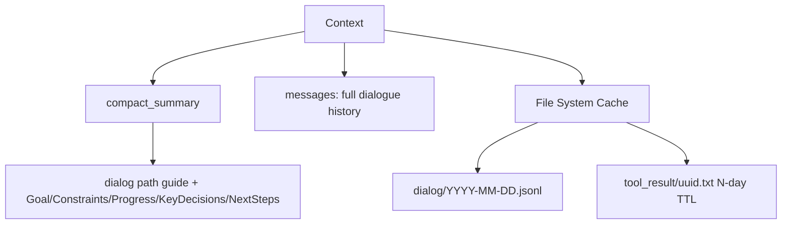
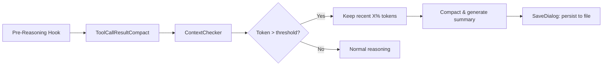
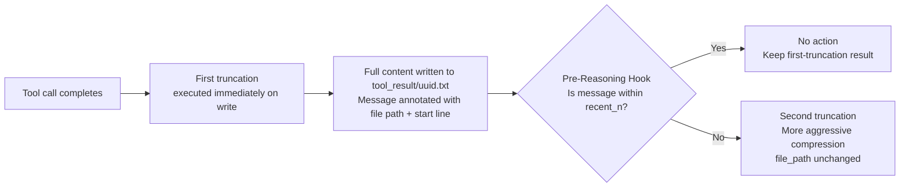
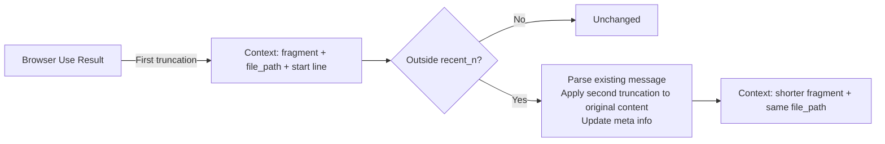
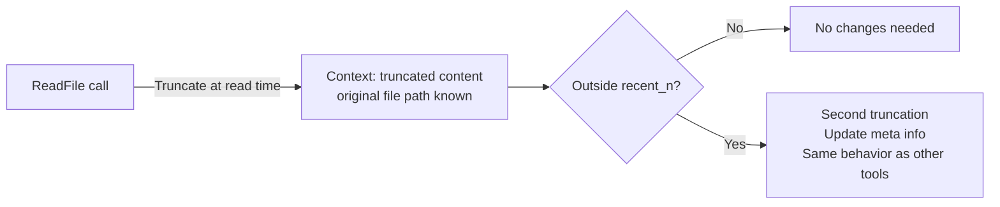
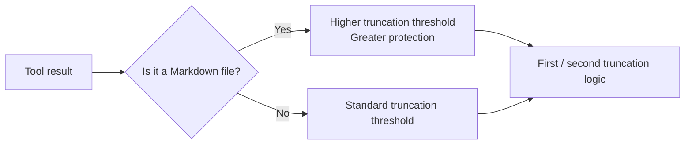
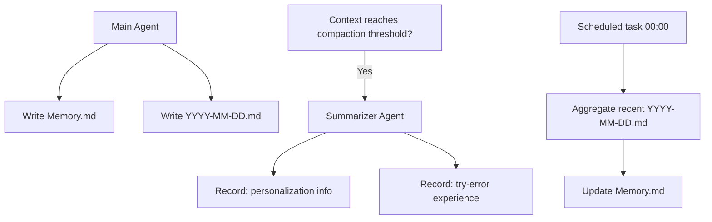

# CoPaw Context Management Design

> This article focuses on **short-term context management** and does not cover the long-term memory module.

---

Sooner or later, every AI Agent hits the same wall: **the context window fills up**.

Tool calls return walls of HTML, thousands of lines of logs, or entire file contents — all of which rapidly consume precious token budget. As the conversation grows, early information either gets truncated or blows up the window entirely, and the Agent's performance begins to degrade.

[CoPaw](https://github.com/agentscope-ai/CoPaw) addresses this problem with a systematic approach to context management. This article provides a complete breakdown of the data structures and runtime mechanics behind **CoPaw Context Management V2**.

---

## What does the context look like?

Before discussing "how to manage it", let's first understand "what is being managed".

CoPaw's context is split into two layers: the **in-memory layer** and the **file system layer**.

### In-Memory Layer

Two core fields are maintained in memory:

- **`compact_summary`** (optional): After conversation history has been compacted, this field holds a structured summary covering five dimensions — `Goal`, `Constraints`, `Progress`, `KeyDecisions`, and `NextSteps` — essentially a refined "work memo". It also includes a **path guide to the raw historical dialog**, pointing the Agent to `dialog/YYYY-MM-DD.jsonl` and suggesting reading from the end backwards.
- **`messages`**: The complete list of messages for the current conversation — the data actually consumed by the Agent during reasoning.

### File System Layer (File Cache)

For content that is too large or too volatile to reside in memory long-term, CoPaw offloads it to the file system:

- **Raw conversation history**: `dialog/YYYY-MM-DD.jsonl`, stored per day
- **Tool call results**: `tool_result/{uuid}.txt`, with an N-day TTL and automatic cleanup on expiry



This design allows the Agent to quickly access recent conversations in memory while being able to look up historical context on demand — without stuffing all history into the context window.

---

## What happens before reasoning? The Pre-Reasoning Hook

Before each reasoning step begins, CoPaw executes a **Pre-Reasoning Hook** that automatically tidies up the context. The process runs in four steps:

1. **Tool result compaction** (`ToolCallResultCompact`): Process tool call results first — truncate oversized content and offload it to the file system.
2. **Context checking** (`ContextChecker`): Compute the current token usage and determine whether it exceeds the threshold.
3. **If the threshold is exceeded**:
   - Keep the most recent **X%** of tokens (to preserve conversational continuity).
   - Call the `Compactor` on the earlier history to generate a structured summary.
4. **Dialog persistence** (`SaveDialog`): Save the compacted raw conversation to the file system.



This flow ensures that the context is in a "clean" state at the start of every reasoning step.

---

## Tool Result Offload: Unified Two-Phase Truncation

Tool call results are one of the main causes of context bloat. CoPaw uses a **two-phase truncation** strategy that separates the timing of truncation from its aggressiveness:

- **First truncation**: Triggered immediately when a tool call result is **written into the context**, uniformly applied to all tools (including `read_file`). The full raw content is saved to `tool_result/{uuid}.txt`, and the message is annotated with the file path and a start-line hint.
- **Second truncation**: Triggered by the Pre-Reasoning Hook on **messages that have slid out of the `recent_n` window**, applying a more aggressive truncation to further shrink context usage.



The benefit of this design is: the first truncation ensures that no tool result can blow up the context from the moment it is written; the second truncation automatically "fades out" older messages as the conversation progresses, always leaving enough room for recent content.

### Browser Use Tools as an Example

| Phase                      | Behavior                                                                                                                    |
|----------------------------|-----------------------------------------------------------------------------------------------------------------------------|
| First truncation           | Result is truncated immediately on return; full content written to `tool_result/uuid.txt`; message annotated with "FullText saved to xxxx, please read from line N" |
| Within `recent_n`          | Pre-Reasoning Hook makes no additional changes; keeps first-truncation result                                               |
| Outside `recent_n` (second truncation) | Parses the existing message result, applies more aggressive truncation to the original content, updates meta info (e.g. line-number hint); **`file_path` is unchanged**, still pointing to the original file |

The key insight of second truncation: **the original full content is always saved under the same file path**. No matter how many rounds of truncation have occurred, the Agent can always retrieve the original content via the file reference. Truncation only affects the message fragment and meta info in the context — never the file itself.



### Code Implementation and Examples of Two-Phase Truncation

The entry point for truncation logic is `truncate_text_output`, which dispatches to two different functions depending on whether the text already contains the `<<<TRUNCATED>>>` marker:

```python
def truncate_text_output(text, start_line=1, total_lines=0,
                         max_bytes=DEFAULT_MAX_BYTES,
                         file_path=None, encoding="utf-8") -> str:
    if TRUNCATION_NOTICE_MARKER in text:
        return _retruncate(text, max_bytes=max_bytes, encoding=encoding)
    else:
        return _truncate_fresh(text, start_line=start_line,
                               total_lines=total_lines,
                               max_bytes=max_bytes,
                               file_path=file_path, encoding=encoding)
```

#### First Truncation (`_truncate_fresh`)

**When it fires**: Immediately when the tool call completes and the result is written into the context — the text does not yet contain a truncation marker at this point.

**Core logic**:

1. If the text size in bytes does not exceed `max_bytes`, return the original text as-is.
2. Otherwise, slice by bytes, keep the last complete line before the cut point, and compute the start line for the next read.
3. Append a truncation notice (`<<<TRUNCATED>>>`) at the end, prompting the reader to continue from `start_line=N`.

**Example**: Suppose a tool returns 3,000 lines of HTML (200 KB in total), and `max_bytes = 50 KB`:

```
# Original tool output (200 KB, 3000 lines)
<html>
  <head>...</head>
  <body>
    ...(large content)
  </body>
</html>

# After first truncation, written to context (50 KB, ~750 lines)
<html>
  <head>...</head>
  <body>
    ...(first 750 lines)
<<<TRUNCATED>>>
The output above was truncated.
The full content is saved to the file and contains 3000 lines in total.
This excerpt starts at line 1 and covers the next 51200 bytes.
If the current content is not enough, call `read_file` with file_path=tool_result/abc123.txt start_line=751 to read more.
```

The full raw content is simultaneously written to `tool_result/abc123.txt`; only the truncated fragment and the continuation hint are kept in the context.

#### Second Truncation (`_retruncate`)

**When it fires**: During Pre-Reasoning Hook processing, applied to messages that have slid out of the `recent_n` window to further shrink context usage.

**Core logic**:

1. Split the text into the raw content before `<<<TRUNCATED>>>` and the notice section after it.
2. If the raw content still fits within the new `max_bytes` (with a 100-byte slack), return the original text as-is.
3. Otherwise, re-slice according to the new, smaller byte limit and use regex to update the **byte count** and **continuation line number** in the notice; `file_path` remains unchanged.

**Example**: The same tool message from above, after it slides out of `recent_n`. Second truncation reduces `max_bytes` from 50 KB to 10 KB:

```
# Before second truncation (first-truncation result already in context, 50 KB)
<html>
  <head>...</head>
  <body>
    ...(first 750 lines)
<<<TRUNCATED>>>
...This excerpt starts at line 1 and covers the next 51200 bytes.
...call `read_file` with file_path=tool_result/abc123.txt start_line=751 to read more.

# After second truncation (further compressed to 10 KB, ~150 lines)
<html>
  <head>...</head>
  <body>
    ...(first 150 lines)
<<<TRUNCATED>>>
...This excerpt starts at line 1 and covers the next 10240 bytes.
...call `read_file` with file_path=tool_result/abc123.txt start_line=151 to read more.
```

Key point: `file_path` always points to `tool_result/abc123.txt`. The Agent can retrieve the full original content via the file reference at any time; truncation only affects the context fragment and meta info.

---

## Special Handling for the ReadFile Tool

`read_file` shares the same two-phase truncation mechanism as Browser Use tools, with one key difference: **the file it reads already exists on the file system**, so there is no need to save a separate copy during first truncation.

| Phase                      | Behavior                                                                                      |
|----------------------------|-----------------------------------------------------------------------------------------------|
| First truncation           | Truncation happens at read time; result is written to context; original file path is already known — no need to save to `tool_result/` |
| Within `recent_n`          | Pre-Reasoning Hook makes no changes; keeps the read-time truncation result                    |
| Outside `recent_n` (second truncation) | Same as other tools — more aggressive truncation is applied to the message content, meta info is updated |



### Special Protection for Markdown Files

For Markdown files such as `skill.md` and rule files, CoPaw applies a **higher protection threshold** during truncation.

Markdown files typically carry structured knowledge or instructions; over-aggressive truncation would break their semantic integrity. Therefore, both the first and second truncation thresholds for Markdown files are set higher than those for regular tool outputs, ensuring the Agent can read as complete a structured content as possible.



---

## Long-term Memory Trigger Logic

> This section goes beyond the core scope of context management and briefly introduces CoPaw's long-term memory write mechanism.

Long-term memory is driven by three trigger paths:

1. **Explicitly written by the Main Agent**:
   - `Memory.md` (the backbone of long-term memory, recording persistent information such as user preferences)
   - `YYYY-MM-DD.md` (daily log)

2. **Triggered by context compaction**, written by the **Summarizer (ReAct Agent)**:
   - Personalization information (user preferences, habits, etc.)
   - Try-error information (failed attempts and corrective lessons)

3. **Scheduled task** (daily at 00:00):
   - Aggregates recent `YYYY-MM-DD.md` files
   - Merges and updates the journal into `Memory.md`



This mechanism ensures that important information from short-term conversations is distilled into long-term memory and not lost when the session ends.

---

## Summary

The core design philosophy of CoPaw's context management can be summed up in one sentence:

**Keep only "what is needed now" in memory; let the file system hold "what might be needed later".**

Through the four-step Pre-Reasoning Hook flow, a unified two-phase truncation strategy, and persistent file system backing, CoPaw maximizes information availability for the Agent within a limited context window — no matter how long the conversation runs, the Agent can always find the context it needs.

---

*The design described in this article is implemented in [CoPaw MemoryManager](https://github.com/agentscope-ai/CoPaw/blob/main/src/copaw/agents/memory/reme_light_memory_manager.py) and [ReMe ReMeLight](https://github.com/agentscope-ai/ReMe).*
