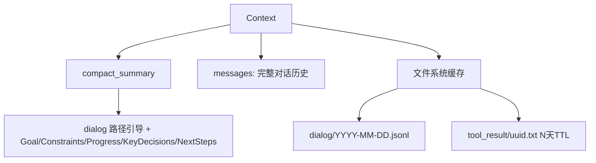
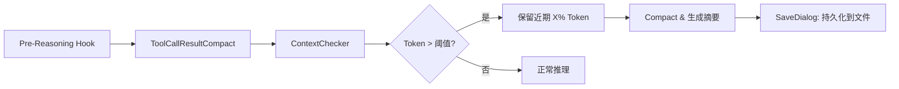
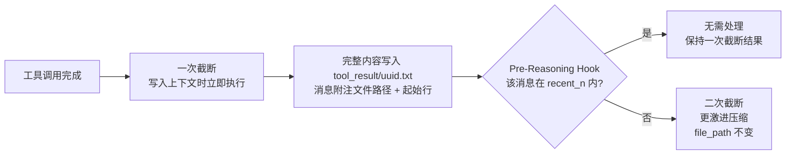
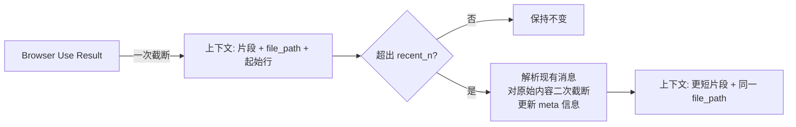
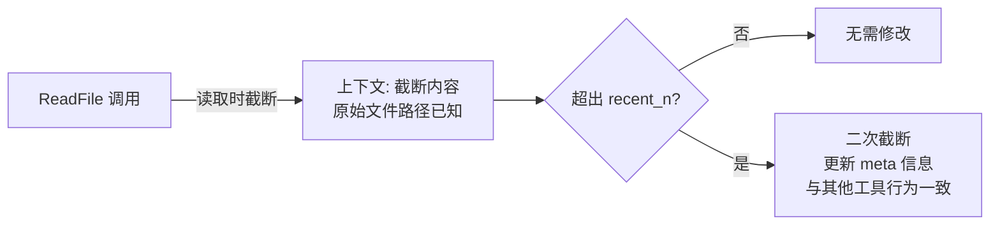
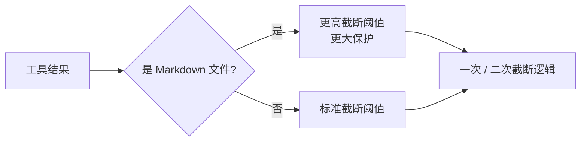
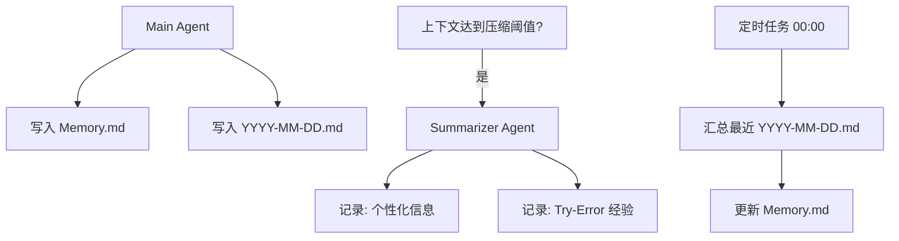

# CoPaw 上下文管理设计解析

> 本文聚焦**短期上下文管理**，不涉及长期记忆模块。

---

AI Agent 在使用过程中，迟早会遇到一个让人头疼的问题：**上下文窗口被塞满了**。

工具调用返回了一大段 HTML、几千行日志、或者完整的文件内容——这些都会急剧消耗宝贵的 Token
配额。随着对话轮次增加，早期的信息要么被截断，要么把整个窗口撑爆，Agent 的表现开始下滑。

[CoPaw](https://github.com/agentscope-ai/CoPaw) 在设计上下文管理时，围绕这个问题给出了一套系统性的答案。本文将完整拆解 *
*CoPaw Context Management V2** 的数据结构与运行机制。

---

## 上下文长什么样？

在讨论"如何管理"之前，先看清楚"管理的是什么"。

CoPaw 的上下文分为两层：**内存层**与**文件系统层**。

### 内存层（In-Memory）

内存中维护两个核心字段：

- **`compact_summary`**（可选）：当历史对话被压缩后，这里存放结构化摘要，包含 `Goal`、`Constraints`、`Progress`、`KeyDecisions`、
  `NextSteps` 五个维度——相当于一份精炼的"工作备忘录"。同时还包含一个**历史对话原始数据的路径引导**，告诉 Agent 去哪里找
  `dialog/YYYY-MM-DD.jsonl`，以及建议"从后往前读"。
- **`messages`**：当前对话的完整消息列表，是 Agent 实际推理时消费的数据。

### 文件系统层（File Cache）

对于体积较大、不适合长期驻留内存的内容，CoPaw 将其 offload 到文件系统：

- **历史对话原始数据**：`dialog/YYYY-MM-DD.jsonl`，按日期分文件存储
- **工具调用结果**：`tool_result/{uuid}.txt`，设有 N 天 TTL，过期自动清理



这个设计让 Agent 既能在内存中快速访问近期对话，又能在需要时按需回溯历史——而不是把所有历史内容硬塞进上下文。

---

## 推理前做什么？Pre-Reasoning Hook

每轮推理正式开始前，CoPaw 会执行一个 **Pre-Reasoning Hook**，自动完成上下文的整理工作。整个流程分四步：

1. **工具结果压缩**（`ToolCallResultCompact`）：先处理工具调用结果，将超长内容截断并 offload 到文件系统
2. **上下文检查**（`ContextChecker`）：计算当前上下文的 Token 使用量，判断是否超出阈值
3. **若超出阈值**：
    - 保留最近 **X%** 的 Token（保障对话连贯性）
    - 对更早的历史对话调用 `Compactor` 生成结构化摘要
4. **历史对话持久化**（`SaveDialog`）：将被压缩的原始对话保存到文件系统



这个流程确保每次推理开始前，上下文都处于一个"干净"的状态。

---

## 工具结果 Offload：统一的两阶段截断

工具调用结果是上下文膨胀的主要来源之一。CoPaw 采用**两阶段截断**策略，将截断时机与截断力度分离：

- **一次截断**：在工具调用结果**写入上下文时**立即触发，所有工具（包括 `read_file`）统一适用。截断后将完整原始内容保存到
  `tool_result/{uuid}.txt`，并在消息中附注文件路径与起始行提示。
- **二次截断**：在 Pre-Reasoning Hook 处理时，对**已滑出 `recent_n` 范围**的历史消息触发，截断更为激进，进一步压缩上下文占用。



这样设计的好处在于：一次截断保证所有工具结果从写入那刻起就不会撑爆上下文；二次截断则随着对话推进自动"淡化"
历史信息，始终为近期内容留出充足空间。

### 以 Browser Use 类工具为例

| 阶段                | 行为                                                                                 |
|-------------------|------------------------------------------------------------------------------------|
| 一次截断              | 工具返回结果后立即截断，完整内容写入 `tool_result/uuid.txt`，消息附注 "FullText saved to xxxx，请从第 N 行开始读" |
| 在 recent_n 内      | Pre-Reasoning Hook 不做额外处理，保持一次截断结果                                                 |
| 超出 recent_n（二次截断） | 解析已有的消息结果，对原始内容做更激进的截断，同步更新消息中的 meta 信息（如行号提示）；**`file_path` 不变**，仍指向原文件           |

二次截断的关键在于：**原始完整内容始终保存在同一个文件路径下**，无论经过多少轮截断，Agent 都能通过文件引用找到原始内容；截断只影响上下文中的消息片段和
meta 信息，不改变文件。



### 两阶段截断的代码实现与示例

截断逻辑的入口是 `truncate_text_output`，它根据文本中是否已包含 `<<<TRUNCATED>>>` 标记来分发到两个不同的函数：

```python
def truncate_text_output(text, start_line=1, total_lines=0,
                         max_bytes=DEFAULT_MAX_BYTES,
                         file_path=None, encoding="utf-8") -> str:
    if TRUNCATION_NOTICE_MARKER in text:
        return _retruncate(text, max_bytes=max_bytes, encoding=encoding)
    else:
        return _truncate_fresh(text, start_line=start_line,
                               total_lines=total_lines,
                               max_bytes=max_bytes,
                               file_path=file_path, encoding=encoding)
```

#### 一次截断（`_truncate_fresh`）

**触发时机**：工具调用完成、结果写入上下文时立即执行，此时文本中尚不含截断标记。

**核心逻辑**：

1. 若文本字节数未超过 `max_bytes`，直接返回原文；
2. 否则按字节切片，保留截断点前最后一个完整行，计算下一段应从哪一行开始；
3. 在末尾追加截断通知（`<<<TRUNCATED>>>`），提示后续从 `start_line=N` 继续读取。

**示例**：假设一个工具返回了 3 000 行的 HTML 内容（共 200 KB），而 `max_bytes = 50 KB`：

```
# 原始工具输出（200 KB，共 3000 行）
<html>
  <head>...</head>
  <body>
    ...（大量内容）
  </body>
</html>

# 一次截断后写入上下文（50 KB，约 750 行）
<html>
  <head>...</head>
  <body>
    ...（前 750 行）
<<<TRUNCATED>>>
The output above was truncated.
The full content is saved to the file and contains 3000 lines in total.
This excerpt starts at line 1 and covers the next 51200 bytes.
If the current content is not enough, call `read_file` with file_path=tool_result/abc123.txt start_line=751 to read more.
```

完整原始内容同时写入 `tool_result/abc123.txt`，上下文中仅保留截断片段与续读提示。

#### 二次截断（`_retruncate`）

**触发时机**：Pre-Reasoning Hook 处理时，对已滑出 `recent_n` 范围的历史消息执行，进一步压缩上下文占用。

**核心逻辑**：

1. 从文本中分离出 `<<<TRUNCATED>>>` 前的原始内容与后面的通知部分；
2. 若原始内容仍未超出新的 `max_bytes`（带 100 字节宽松量），直接返回原文；
3. 否则按新的更小字节限制重新切片，并通过正则替换通知中的 **字节数** 与 **续读行号**，`file_path` 保持不变。

**示例**：同样是上面那条工具消息，在它滑出 `recent_n` 之后，二次截断将 `max_bytes` 从 50 KB 压缩到 10 KB：

```
# 二次截断前（上下文中已有一次截断结果，50 KB）
<html>
  <head>...</head>
  <body>
    ...（前 750 行）
<<<TRUNCATED>>>
...This excerpt starts at line 1 and covers the next 51200 bytes.
...call `read_file` with file_path=tool_result/abc123.txt start_line=751 to read more.

# 二次截断后（进一步压缩至 10 KB，约 150 行）
<html>
  <head>...</head>
  <body>
    ...（前 150 行）
<<<TRUNCATED>>>
...This excerpt starts at line 1 and covers the next 10240 bytes.
...call `read_file` with file_path=tool_result/abc123.txt start_line=151 to read more.
```

关键点：`file_path` 始终指向 `tool_result/abc123.txt`，Agent 随时可通过文件引用获取完整原始内容；截断只影响上下文片段与 meta 信息。

---

## ReadFile 工具的特殊处理

`read_file` 与 Browser Use 类工具共享同一套两阶段截断机制，但有一个关键区别：**它读取的文件本身已存在于文件系统**
，无需在一次截断时另行保存。

| 阶段                | 行为                                                |
|-------------------|---------------------------------------------------|
| 一次截断              | 在读取时即完成截断，结果写入上下文；原始文件路径已知，无需额外保存到 `tool_result/` |
| 在 recent_n 内      | Pre-Reasoning Hook 不做任何修改，保持读取时的截断结果              |
| 超出 recent_n（二次截断） | 与其他工具相同，对消息内容做更激进的截断，更新 meta 信息                   |



### Markdown 文件的特殊保护

对于 `skill.md`、规则文件等 Markdown 文件，CoPaw 在截断时给予**更大的保护阈值**。

Markdown 文件通常承载结构化的知识或指令，过度截断会破坏其完整语义。因此，在一次截断和二次截断时，Markdown
文件的截断触发上限均高于普通工具输出，确保 Agent 能读到尽可能完整的结构化内容。



---

## 长期记忆的触发逻辑

> 本节超出上下文管理的核心范畴，简要介绍 CoPaw 的长期记忆写入机制。

长期记忆由三个触发路径驱动：

1. **主 Agent 主动写入**：
    - `Memory.md`（长期记忆主干，记录用户偏好等持久信息）
    - `YYYY-MM-DD.md`（当日日志）

2. **上下文压缩触发时**，由 **Summarizer（ReAct Agent）** 写入：
    - 个性化信息（用户偏好、习惯等）
    - Try-error 信息（失败尝试与修正经验）

3. **定时任务**（每日 00:00）：
    - 汇总最近的 `YYYY-MM-DD.md` 文件
    - 将日志整合更新到 `Memory.md`



这套机制确保了短期对话中的重要信息能够沉淀为长期记忆，不因对话结束而丢失。

---

## 小结

CoPaw 上下文管理的核心设计哲学可以用一句话概括：

**让内存只放"现在需要的"，让文件系统保管"之后可能需要的"。**

通过 Pre-Reasoning Hook 的四步流程、统一的两阶段截断策略，以及文件系统的持久化支撑，CoPaw 在有限的上下文窗口内为 Agent
提供了最大程度的信息可用性——无论对话持续多久，Agent 总能找到它需要的上下文。

---

*本文设计对应实现可参考 [CoPaw MemoryManager](https://github.com/agentscope-ai/CoPaw/blob/main/src/copaw/agents/memory/reme_light_memory_manager.py)
与 [ReMe ReMeLight](https://github.com/agentscope-ai/ReMe)。*
